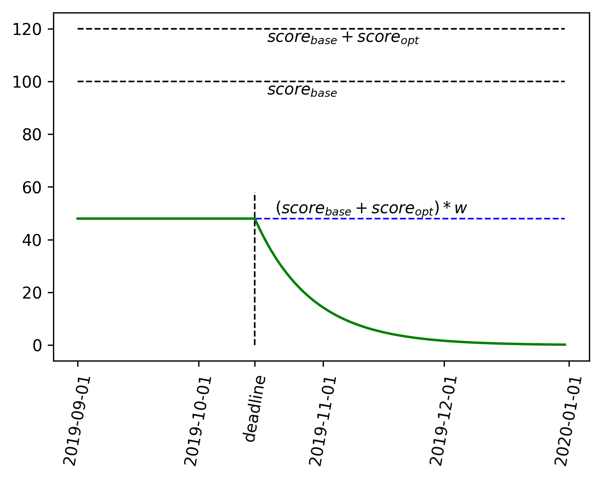

# ML4ES2: 2022-2023
### Метод оценки прогресса студентов

Домашние задания публикуются со следующими атрибутами:

- Вес задания (например, 0.4). Коэффициент сложности/трудности, с которым оценивается вклад ДЗ в общий балл за семестр.

Дальнейшее оценивание прогресса студента по каждому ДЗ производится по формуле:
$$
S=Score*w*exp\left(\frac{min\left(deadline-date\_submitted, 0\right)}{14}\right)
$$

Пояснение - на рис. 1.

Рис. 1. Оценка домашнего задания (зеленая линия) в зависимости от даты сдачи.

В конце семестра все баллы суммируются.
